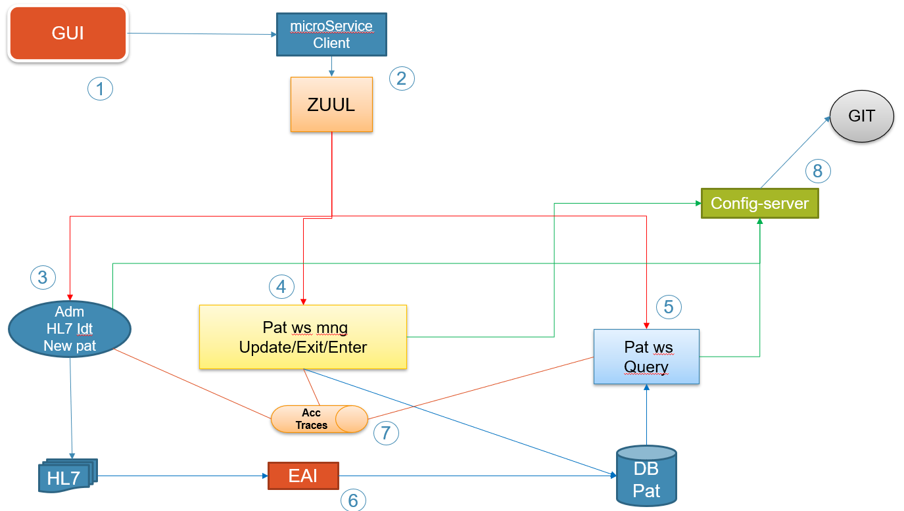
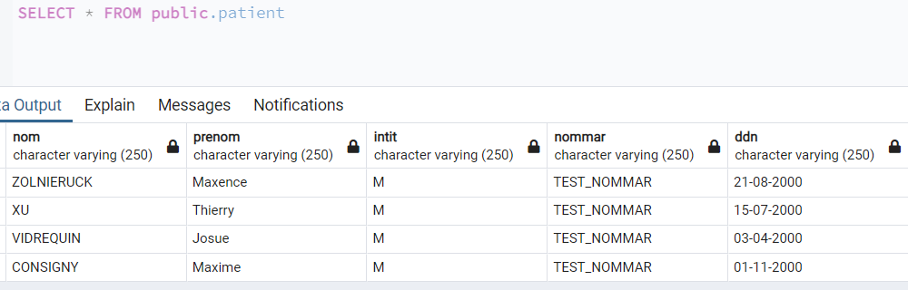
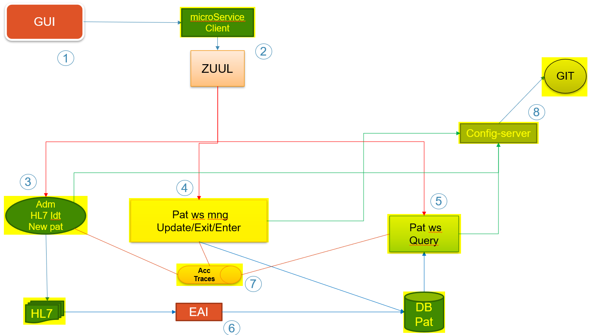

# TP ADS Architecture

- [TP ADS Architecture](#tp-ads-architecture)
  - [Groupe](#groupe)
  - [Introduction](#introduction)
  - [Visualisation de l'architecture](#visualisation-de-larchitecture)
  - [Les bases de données](#les-bases-de-données)
    - [Pour les patients](#pour-les-patients)
    - [Pour les logs](#pour-les-logs)
  - [Les modules](#les-modules)
    - [Service de création](#service-de-création)
    - [Service de recherche](#service-de-recherche)
    - [Service de modification & suppression](#service-de-modification--suppression)
  - [Configuration distante](#configuration-distante)
  - [Scripts automatisés](#scripts-automatisés)
  - [Requetes Postman](#requetes-postman)
  - [Problèmes rencontrés](#problèmes-rencontrés)
    - [ZUUL Proxy](#zuul-proxy)
    - [Mirth Connect](#mirth-connect)
    - [GUI](#gui)
  - [Récapitulatif](#récapitulatif)

## Groupe

Ce projet a été réalisé par 4 étudiants de l'INSA Hauts-de-France.
Le groupe est composé de :

- ZOLNIERUCK Maxence
- XU Thierry
- VIDREQUIN Josué
- CONSIGNY Maxime

Tous membres de la promotion FISA 4 Informatique.

## Introduction

Ce projet a pour but de réaliser une maquette architecturale d'un hopital.

Plusieurs modules sont impliqués dans cette maquette, pour la création, suppression, modification et visualisation des données.

Toutes les actions sont enregistrés dans une base de données de log qui permet d'ajouter de la traçabilité aux requêtes.

## Visualisation de l'architecture



## Les bases de données

Ce projet dispose de deux bases de données : une pour les données patients et une autre pour les traces applicatives.

Les deux bases de données sont des PostgreSQL v12.

### Pour les patients

Cette base de données d'appelle **dbpat** pour DataBase Patients.

Les fichiers sont dans le repertoire [DB_Pat](./DB_Pat/).

La base de données est initialisée avec le script [init.sql](/DB_Pat/init.sql).

Pour lancer le service, il suffit de lancer un invite de commande dans le repertoire [DB_Pat](./DB_Pat/) et d'executer :

> docker compose up -d

Données par défaut dans la base de données :



### Pour les logs

Cette base de données d'appelle **dblog** pour DataBase Logs.

Les fichiers sont dans le repertoire [DB_Traces](./DB_Traces/).

La base de données est initialisée avec le script [init.sql](/DB_Traces/init.sql).

Pour lancer le service, il suffit de lancer un invite de commande dans le repertoire [DB_Traces](./DB_Traces/) et d'executer :

> docker compose up -d

## Les modules

### Service de création

Ce service permet de générer des fichiers **.hl7** correspondants à la création d'un patient en base de données.

La ressource est exposée via l'url **http://BASE_URL/api/adm** en méthode HTTP POST.

Les fichiers **.hl7** sont générés et stockés dans le dossier [outputs](./wscreate/outputs/).

Chaque demande de création de patient est loggé dans la base de données **DB_Traces**.

Ce service peut être démarré par invite de commande dans le repertoire [wscreate](./wscreate/) avec :

> ./runDocker.bat

Ce service est exposé sur le port **8080**.

### Service de recherche

Ce service permet de chercher un patient via son **nom**, **prénom** ou **date de naissance**.

La ressource est exposée via l'url **http://BASE_URL/api/search** en méthode HTTP GET avec les query params :

- nom
- prenom
- ddn (pour la date de naissance)


Exemples :
- **http://BASE_URL/api/search?nom=VIDREQUIN**
- **http://BASE_URL/api/search?prenom=Thierry**
- **http://BASE_URL/api/search?ddn=21-08-2000**

Le service peut réagir de deux façons différentes :
- Retourner les informations du patient s'il est trouvé en base de données
- Retourner **NO_RESULT** si le patient n'a pas été trouvé

Chaque demande recherche de patient est loggé dans la base de données **DB_Traces**.

Ce service peut être démarré par invite de commande dans le repertoire [wsrequete](./wsrequete/) avec :

> ./runDocker.bat

Ce service est exposé sur le port **8081**.

### Service de modification & suppression

TODO

## Configuration distante

Tous les Web Services sont au moins connecté à une base de données, celle des logs. Certains sont aussi connectés à la base de données patients.

La configuration postgreSQL nécessaire à la connextion aux bases de données est stockés sur GitHub dans un dépôt différent : [postgres.conf](https://github.com/mxcezl/config-pg-java/blob/main/postgres.conf).

Celle-ci comporte : 

```
postgres.pat.username = postgres
postgres.pat.password = postgres
postgreS.pat.jdbc.url = jdbc:postgresql://host.docker.internal:5433/dbpat

postgres.log.username = postgres
postgres.log.password = postgres
postgreS.log.jdbc.url = jdbc:postgresql://host.docker.internal:5434/dblog
```

Cette dernière est récupérée dans tous les modules afin d'effectuer les connexions.

Exemple dans [wsrequete](./wsrequete/src/main/java/com/ads/wsrequete/conf/ConfLoader.java) :

```java
private static final String CONF_GIT_URL = "https://raw.githubusercontent.com/mxcezl/config-pg-java/main/postgres.conf";
```

## Scripts automatisés

Afin de simplifier l'utilisation et le lancement de toute l'architecture, nous avons réalisé des scripts pour chaque module.

- [DB_Pat](./DB_Pat/runDocker.bat)
- [DB_Traces](./DB_Traces/runDocker.bat)
- [WS Create](./wscreate/runDocker.bat)
- [WS Request](./wsrequete/runDocker.bat)
- [WS Update & Delete](./wsupdatedelete/runDocker.bat)

De plus, ces scripts sont eux mêmes centralisés et automatisés dans ce [script](./runAll.bat).

Lancez la commande :

> ./runAll.bat

**Qui vous permet de lancer tout le projet en même temps.**

## Requetes Postman

Afin de tester aisément les différents services, nous avons créé des requetes sur Postman.

Vous pouvez importer le fichier [TP - ADM.postman_collection.json](./Postman%20collections/TP%20-%20ADM.postman_collection.json) dans votre Postman et directement executer les différentes requêtes.

## Problèmes rencontrés

Bien que notre projet soit fonctionnel au niveau des traces applicatives, des recherches de patients, de la configuration distante, etc. il y a certains points blocants que nous avons rencontrés.

### ZUUL Proxy

Après plusieurs tentatives, nous n'avons pas réussis à mettre en place un ZUUL avec la librairie ZUUL Netflix.

Nous obtenons des erreurs de dépendences cycliques, bien qu'il n'y avait uniquement une seule et unique dépendence dans le projet.

Après quelques renseignements, nous nous sommes rendus compte que cette librairie était dépréciée et qu'il n'y avait pas de remplaçant aussi simple d'utilisation.

### Mirth Connect

Nous n'avons pas su utiliser l'image Docker de Mirth connect tout en utilisant une configuration personnalisée.

De ce fait, le module de création de patient génére bien un fichier **.hl7** cependant il n'y a aucun lien avec la base de données.

Afin de tester nos développements nous avons renseignés via le script [init.sql](./DB_Pat/init.sql) des patients par défaut qui correspondent aux membres du groupe.

### GUI

Malheureusement, pour ce projet nous avons manqué de compétences et de temps sur cette partie. En règle générale nous avons quelques lacunes au niveau des interfaces utilisateurs.

De ce fait, pour ce projet aucune interface graphique n'est disponible.

Cependant, nous vous avons mis à disposition une collection Postman vous permettant de tester les différents services.

## Récapitulatif

Pour résumer nos travaux, voici ule schéma de l'architecture applicative avec, en fluo, les parties corectement développées :



Il nous manque donc une interface, le ZUUL et la partie Mirth Connect.